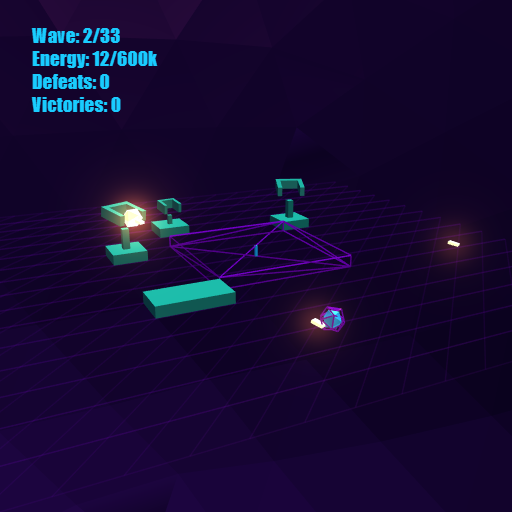
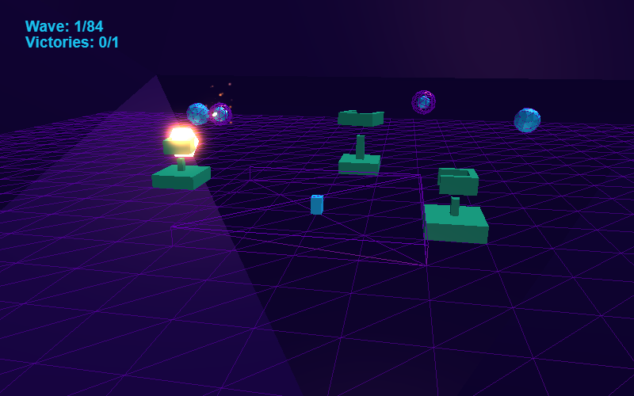

<h1 align="center">Defend</h1>

<p align="center"><strong>A physics-driven strategy game about finite energy, temporary defenses, and the cost of perfect deterrence.</strong></p>

<p align="center">
  <a href="https://xtreemze.github.io/defend/">Play Defend</a> ·
  <a href="https://xtreemze.github.io/defend/labs/">Modern systems labs</a> ·
  <a href="./docs/GAME_DESIGN_MANUAL.md">Game design manual</a> ·
  <a href="./docs/ROADMAP.md">Development roadmap</a> ·
  <a href="./AGENTS.md">Development contract</a> ·
  <a href="https://github.com/xtreemze/defend/issues">Issues</a>
</p>



## Overview

Defend is a strategy game about keeping a fragile physical system alive.

You begin inside a procedural 3D stronghold protecting a central energy reserve from incoming spherical raiders. That reserve is not merely a score or a health bar: **the same energy is your survival margin, your construction budget, the resource being defended, and the economic consequence of combat.** Every defensive commitment therefore makes the fortress more capable while also spending part of the thing it exists to protect.

Combat is intentionally broader than a damage race. Mass, momentum, collision, obstruction, projectile impulse, line of fire, terrain, gravity, and time can all decide an encounter. A wall can succeed by delaying an attacker until its finite life decays. A projectile can be valuable because it redirects a threat rather than destroys it. Knocking a raider off the arena can be more important than reducing its hit points. The battlefield is a physical system to manipulate, not a path for enemies to follow.

Defenses are temporary. Towers age, higher tiers degrade into lower ones, and the fortress must be continually maintained rather than permanently solved. Successful engagement can replenish energy, so offense sustains defense and passive invulnerability is not automatically optimal.

The larger campaign is built around a systemic inversion: **becoming too successful at defense eventually changes the economy that made the stronghold sustainable.** The player's relationship to the same resource, units, and physical rules then reverses. The intended story is expressed primarily through mechanics and consequences rather than exposition.

## What makes Defend distinct

| Principle | Gameplay consequence |
| --- | --- |
| **Energy is everything** | Health, construction, defended resource, combat recovery, and later strategic operating cost compete in one closed economy. |
| **Physics is gameplay** | Mass, momentum, obstruction, knockback, falling, collision, and spatial clearance are tactical variables rather than visual decoration. |
| **Time is a weapon** | Raiders are finite-lived, so delay, trapping, rerouting, and forcing inefficient approaches can be as valuable as direct damage. |
| **Infrastructure is temporary** | Defensive power degrades. Building buys a period of control rather than permanent accumulation. |
| **One system, two perspectives** | The campaign is designed so the mechanics learned while defending remain legible when the player's strategic role changes. |
| **The world explains itself** | Geometry, motion, color, sound, and visible resource movement should communicate state before text or hidden modifiers do. |

These principles are canonicalized in the [Game Design Manual](./docs/GAME_DESIGN_MANUAL.md). The [development roadmap](./docs/ROADMAP.md) connects those principles to the MCP, architecture ownership, implementation order, and promotion gates. Experimental numbers and implementation approaches are kept separate from identity-level rules.

## The defensive loop

1. Protect the central energy reserve.
2. Read incoming composition, approach geometry, and the condition of the stronghold.
3. Spend finite energy on barriers and progressively stronger temporary towers.
4. Damage, delay, redirect, obstruct, or eject attackers using the physical battlefield.
5. Recover energy through successful engagement while preventing surviving raiders from draining the reserve.
6. Rebuild as defenses age and degrade.
7. Adapt when a locally successful strategy creates a larger economic consequence.



### Towers

- **Tower 1 — barrier:** low-cost physical control that blocks bodies and shapes routes without needing direct damage.
- **Tower 2 — interceptor:** a more responsive projectile tower that combines obstruction with active defense.
- **Tower 3 — heavy turret:** a slower, higher-commitment weapon whose stronger projectile impulse rewards deliberate placement and timing.

Tower tiers are a lifecycle as well as an upgrade path: higher levels eventually degrade through lower levels and disappear.

### Raiders

Raiders share the same physical world but differ through size, mass, momentum, survivability, movement behavior, and corridor access. The design deliberately prefers continuous physical trade-offs over hidden type bonuses and immunities. Weakening, delaying, redirecting, trapping, or ejecting a raider can all be strategically valid outcomes.

## Repository status

Defend already has a playable, historically tested MVP. Modernization now builds on that working game incrementally rather than treating a separate modern preview as its replacement. GitHub Pages publishes the MVP as the primary experience, while Babylon/Bevy/WASM scenes remain adjacent systems laboratories whose capabilities are promoted into the game one certified seam at a time.

| Area | Role today |
| --- | --- |
| `src/` + root Webpack app | **Playable MVP and product trunk.** BabylonJS 3, Cannon physics, procedural audio, PWA delivery, and the established browser gameplay remain live while individual internals are modernized behind certified seams. |
| [`docs/GAME_DESIGN_MANUAL.md`](./docs/GAME_DESIGN_MANUAL.md) | **Canonical game-design source of truth.** Separates enduring principles, measured/current baseline behavior, and experimental hypotheses. |
| [`docs/ROADMAP.md`](./docs/ROADMAP.md) | **Canonical integration roadmap.** Defines the MCP, architecture ownership, development sequence, critical path, and promotion gates across parallel work. |
| [`docs/design/`](./docs/design/) | **Focused system chapters and experiments** for energy flow, world ecology, mothership/raider play, geothermal power, locomotion, terrain, and related mechanics. |
| [`crates/defend-core/`](./crates/defend-core/) | **Dependency-light deterministic Rust core** for formulas, topology, and contracts that benefit from portable executable tests. |
| [`experiments/storybook/`](./experiments/storybook/) | **Interactive systems laboratory** for deterministic fixtures, design experiments, visual inspection, and behavior certification. |
| [`experiments/hybrid-engine/`](./experiments/hybrid-engine/) | **Adjacent modern systems lab.** Babylon 9 and headless Bevy/Rust WASM exercise candidate subsystems and integration contracts. It informs and supplies incremental MVP upgrades; it is not a second product implementation. |

### Modernization direction

The current architecture direction is intentionally **brownfield and incremental** rather than a wholesale engine rewrite. Start from the working MVP, isolate one responsibility, certify a modern implementation against the existing behavior, integrate it into the MVP, then move to the next seam:

- Babylon.js remains the browser presentation/rendering authority.
- Rust/WASM is introduced where deterministic simulation, testing, portability, or performance justify it.
- Modular Bevy ECS/app/time crates are evaluated as a headless simulation framework without bringing a second renderer into the browser path.
- Physics backends are compared against characterized gameplay behavior before ownership changes.
- Storybook and isolated labs are used to prove contracts before production integration.
- The working MVP stays continuously playable and remains the product trunk; modern labs only become production behavior when their owned subsystem is integrated and certified inside it.

See the [development roadmap](./docs/ROADMAP.md) for the cross-system sequence, [issue #66](https://github.com/xtreemze/defend/issues/66) for the architecture program, and [`docs/LOCAL_CERTIFICATION.md`](./docs/LOCAL_CERTIFICATION.md) for the evidence model used before promotion.

## Explore the project

- **Playable MVP:** [xtreemze.github.io/defend](https://xtreemze.github.io/defend/)
- **Modern systems labs:** [xtreemze.github.io/defend/labs/](https://xtreemze.github.io/defend/labs/)
- **Design:** [`docs/GAME_DESIGN_MANUAL.md`](./docs/GAME_DESIGN_MANUAL.md)
- **Development roadmap / MCP:** [`docs/ROADMAP.md`](./docs/ROADMAP.md)
- **Focused design chapters:** [`docs/design/`](./docs/design/)
- **Development invariants and agent guidance:** [`AGENTS.md`](./AGENTS.md)
- **Local certification:** [`docs/LOCAL_CERTIFICATION.md`](./docs/LOCAL_CERTIFICATION.md)
- **Storybook laboratory:** [`experiments/storybook/`](./experiments/storybook/)
- **Hybrid engine laboratory:** [`experiments/hybrid-engine/`](./experiments/hybrid-engine/)
- **Architecture modernization:** [issue #66](https://github.com/xtreemze/defend/issues/66)
- **Open work and design discussions:** [GitHub issues](https://github.com/xtreemze/defend/issues)

## Development entry points

The root application intentionally retains its historical dependency graph during migration. For current certification commands and environment expectations, use [`docs/LOCAL_CERTIFICATION.md`](./docs/LOCAL_CERTIFICATION.md).

Historical browser app:

```sh
npm install --package-lock=false --no-audit --no-fund
npm run dev
```

Deterministic Rust core:

```sh
cargo test -p defend-core
```

Storybook laboratory:

```sh
cd experiments/storybook
pnpm install
pnpm typecheck
pnpm build
pnpm test
```

The hybrid-engine experiment has its own reproducible toolchain and run instructions in [`experiments/hybrid-engine/README.md`](./experiments/hybrid-engine/README.md).

## Development philosophy

Modernization should preserve the mechanics that give Defend its identity rather than preserving obsolete implementation techniques. It should also preserve the value of the already working MVP: prefer refactoring and replacing one owned seam at a time over rebuilding equivalent gameplay in parallel. Gameplay changes, architecture changes, and balance changes should remain reviewable independently where practical, with GitHub issues providing durable design context and experiments providing evidence before promotion.

In particular, preserve the closed energy economy, temporary defenses, physical projectiles and knockback, finite-lived raiders, direct battlefield interaction, procedural presentation, and the ability to reduce presentation cost before sacrificing simulation behavior on constrained devices.

## License

Defend is licensed under the [GNU General Public License v3.0](./LICENSE).